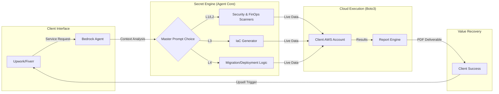

# 🏛️ HOLOCRON V2.6: TECHNICAL LANDSCAPE & SERVICE ORCHESTRATION
## PRIVATE DOCUMENTATION — FOR INTERNAL EYES ONLY

This document outlines the internal logic of the **Holocron Agent Core**. It connects the freelance service catalog to technical implementation and upselling triggers.

---

## 🛰️ 1. The Under-the-Hood Flowchart

---

## 🛠️ 2. Service Logic & Interconnections (The Escalation)

| Service ID | Complexity | Leads To (Upsell) | Technical Reason |
| :--- | :--- | :--- | :--- |
| **S1: Backup Automation** | Low | **S2: Security Hardening** | "Backups are safe, but your access keys are still exposed." |
| **S2: Cost Optimization** | Low | **S3: Performance Tuning** | "We cut costs, now let's make your reduced resources run faster." |
| **S3: Security Hardening** | Medium | **S4: IaC Templates** | "You are secure now. Let's make this setup repeatable via code." |
| **S4: IaC / CloudFormation** | High | **S5: Full Deployment** | "Your templates are ready. Let me deploy your entire app in production." |

---

## 🧠 3. Bedrock Master Prompt Architecture

For each scenario, use the following **Prompting Templates** to ensure the "Secret Engine" behaves as a Senior AWS Architect.

### A. The "Discovery" Prompt (L1/L2)
> "Act as a Senior Cloud Security Auditor. Analyze the Boto3 scanner logs for [Tenant_ID]. Identify critical vulnerabilities in S3 and IAM. Produce a professional executive summary in Brazilian Portuguese, highlighting the ROI of fixing these issues immediately."

### B. The "Architect" Prompt (L3/L4)
> "Act as an AWS Certified Solutions Architect. Based on the client requirement for [Service_Name], generate a modular CloudFormation template. Follow the Well-Architected Framework: Security-first, cost-optimized, and high-availability. Provide the output in YAML with detailed comments for the handover."

---

## 🚩 4. Security & Privacy Protocols
1.  **Isolation:** Never share data between `dados_clientes/empresa_A` and `empresa_B`.
2.  **No Leaks:** This directory (`01_AGENT_CORE`) must NEVER be part of the public GitHub showcase.
3.  **Transparency:** Inform clients that "automated diagnostic tools" are used for 100% precision, but the agent's internal logic is proprietary intellectual property.

---
*Powered by AWS certified mastery and AI-driven precision.*
