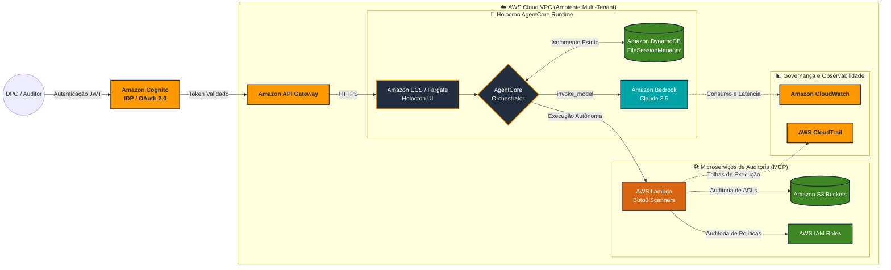

# 🛡️ Holocron Sentinel Startup V2
**DPO Autônomo e Auditor de Cibersegurança Multi-Tenant para AWS**

O **Holocron Sentinel V2** é um projeto proprietário que eleva ferramentas tradicionais de linha de comando para o nível SaaS (Software-as-a-Service). Reescrito inteiramente sob a moderna arquitetura *AgentCore* da AWS, ele atua como um DPO (Data Protection Officer) Virtual Autônomo. 

Sua principal inovação é utilizar a inteligência do **Claude 3.5**, equipando a IA com "Mãos Reais" (Ferramentas Boto3/MCP) para analisar a postura de segurança (S3, IAM) em múltiplas contas AWS corporativas simultaneamente, garantindo isolamento total por cliente de acordo com a LGPD e prevenindo vazamento cruzado (*Data Leakage Block*).

---

## 🏗️ Arquitetura de Produção (AWS Native)

O diagrama abaixo reflete a topologia SaaS projetada para implantação em ambiente corporativo da AWS:

## 🚀 Diferenciais de Mercado (Business Value)
1. **🛡️ Governança Criptográfica Multi-Tenant:** O sistema isola memórias localmente. Se o "Cliente Alfa" solicitar varreduras secretas, o Histórico do "Cliente Beta" sequer pode ser acessado em ataques de injeção de prompt no Agente (Anti-Espionagem Ativa).
2. **🤖 Agência Ativa:** A IA não responde apenas dúvidas da ISO 27001 em prosa. Ela assume o controle do Terminal, chama os Scanners de Vulnerabilidade Boto3 de forma autônoma e devolve relatórios executivos de correção.
3. **📊 Conformidade LGPD Implacável:** Mapeia ACLs perigosas atuando no pilar Preventivo imposto pela legislação brasileira para startups parceiras.

---

## 📸 Evidências Visuais e Execução
🛠️ *[Área reservada para demonstrações prontas do produto (Em Breve)]*
- ✔️ **Print 1:** Identificação Autônoma de Buckets Abertos
- ✔️ **Print 2:** Dashboard Multi-Tenant e Proteção Anti-Vazamento (Hack Test)

## 🛠️ Guia de Uso (Workshop DPO)

### 1. Selecionando o Tenant
Na barra lateral do Dashboard, selecione o **ID do Cliente** (Ex: `empresa_alpha`). O motor de IA carregará instantaneamente as memórias e o histórico isolado daquele cliente específico.

### 2. Acionando o Scanner S3
Ao perguntar ao Holocron: *"Realize uma varredura de segurança nos meus buckets"*, o Agente:
1. Pede autorização ao **Orchestrator**.
2. Aciona o script **Boto3 (Scanners.py)** através do protocolo MCP.
3. Analisa as 4 camadas de proteção (BlockPublicAcls, IgnorePublicAcls, etc).
4. Devolve um relatório resumido com os nomes dos buckets vulneráveis.

### 3. Teste de Injeção e Proteção
Experimente perguntar sobre dados de outros clientes. O sistema filtrará a solicitação através da camada de **Isolamento de Memória**, impedindo que a IA acesse arquivos `.json` fora do diretório do tenant atual.

---

## ⚖️ Conformidade Legal e Técnica
Este projeto utiliza os pilares da **ISO 27001** e **LGPD Art. 46** (Medidas de Segurança) para demonstrar a viabilidade de Agentes Autônomos em ambientes de Nuvem Controlados.

*Desenvolvido como projeto de vitrine para o curso AWS re/Start.*

