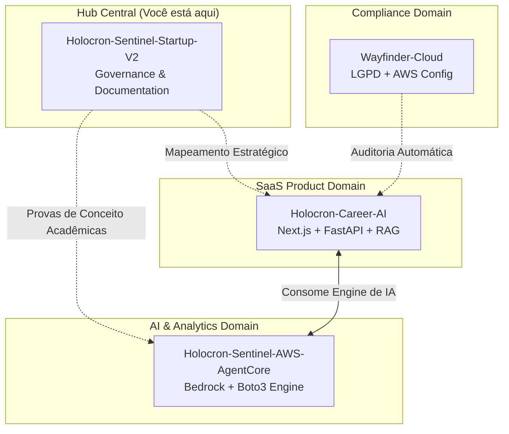

# 🌌 HOLOCRON: The Expert AWS Consultant Ecosystem
## AWS Certified Cloud Practitioner Portfolio & Global Agency Engine

Welcome to the **Holocron Ecosystem**. This project is the culmination of technical excellence in the **AWS re/Start 2026** program, transformed into a high-performance freelance consulting machine focused on Security, Compliance (LGPD), and Cost Optimization.

---

## 🏛️ Project Pillars (Folder Structure)

This repository is organized into 4 distinct pillars to ensure maximum clarity, security, and professionalism:

### [📁 01_AGENT_CORE (SECRET PROPRIETARY CODY)](./01_AGENT_CORE/)
> **The Secret Sauce.** This is the technical infrastructure built with **AWS AgentCore (Strands SDK)** and **Amazon Bedrock**. It automates 95% of consulting technical labor (Audits, S3 Scanning, Cost analysis) using autonomous AI agents.

### [📁 02_PUBLIC_SHOWCASE (THE VITRINE)](./02_PUBLIC_SHOWCASE/)
> **Your Commercial Identity.** This folder contains the customer-facing documentation, case studies, and the [**Service-to-Lab Mapping**](./02_PUBLIC_SHOWCASE/SERVICE_MAPPING.md) that proves how academic knowledge solves real business problems.

### [📁 03_BUSINESS_DESK (STRATEGY)](./03_BUSINESS_DESK/)
> **The Sales Office.** Scripts, Bidding Guides, and the [**Master Plan**](./03_BUSINESS_DESK/MASTER_PLAN_FREELANCER_AWS.md) to launch a high-ticket freelance career.

### [📁 04_AWS_RESTART_LABS (ACADEMIC EVIDENCE)](./04_AWS_RESTART_LABS/)
> **The Technical Proof.** Raw, hands-on evidence of every lab performed during certification.

---

## 🌐 O Ecossistema Holocron (Arquitetura Distribuída)

Para lidar com a complexidade de um sistema corporativo real, o ecossistema Holocron foi segmentado em microsserviços e domínios de repositório, seguindo as melhores práticas de Engenharia de Software (Desacoplamento e Independência de Deploy).

```mermaid
flowchart TD
    subgraph "Hub Central (Você está aqui)"
        V2[Holocron-Sentinel-Startup-V2\nGovernance & Documentation]
    end

    subgraph "SaaS Product Domain"
        Career[Holocron-Career-AI\nNext.js + FastAPI + RAG]
    end

    subgraph "AI & Analytics Domain"
        AgentCore[Holocron-Sentinel-AWS-AgentCore\nBedrock + Boto3 Engine]
    end

    subgraph "Compliance Domain"
        Wayfinder[Wayfinder-Cloud\nLGPD + AWS Config]
    end

    V2 -.->|Mapeamento Estratégico| Career
    V2 -.->|Provas de Conceito Acadêmicas| AgentCore
    Career <-->|Consome Engine de IA| AgentCore
    Wayfinder -.->|Auditoria Automática| Career
```

### 🛡️ Padrões Enterprise do Ecossistema
1. **Governança Multirepo:** Separação estrita entre o produto cliente (`Career-AI`), o motor de IA (`AgentCore`) e ferramentas de compliance interna (`Wayfinder`).
2. **Infraestrutura Cloud-Native:** Dependências pesadas em Serverless, AWS CDK (IaC) e arquiteturas orientadas a eventos (EventBridge).
3. **Segurança (Zero Trust):** Rastreamento de IA e LGPD integrados desde o design (Privacy by Design).

---

## 📈 Roadmap: The Path to AWS Developer / Architect
The Holocron ecosystem is evolving. This project now tracks the journey toward the **DVA-C02** and **SAA-C03** certifications:
- [x] AWS Certified Cloud Practitioner
- [ ] AWS Certified Developer – Associate (In Progress 🚀)
- [ ] AWS Certified Solutions Architect (In Progress 🚀)
- [x] Serverless SaaS Transition (Consolidated via Holocron Career AI)

## 🚀 Vision: Certification + Automation = Results
The Holocron ecosystem proves that an **AWS Certified Professional** armed with advanced **Generative AI Automation** can deliver results faster and more securely.
- **Security:** Deep scans using Boto3 + Bedrock AI for LGPD compliance.
- **Cost (FinOps):** Intelligent detection of orphaned resources and strict AWS Budgets applied to AI Tokens.
- **Infrastructure:** Pro-deployment blueprints for modern web apps using CDK/Terraform.

---

## 👤 Author
**Guilherme Gomes**  
AWS Certified | Cloud Security Auditor | AI Solutions Engineer

---
*Built with ❤️ and Precision. Secure your future in the Cloud today.*
