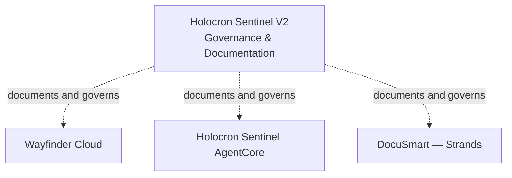

# Holocron Sentinel V2 — Governance & Documentation Hub

This repository is the documentation and governance hub for the Holocron ecosystem. It brings together project references, architecture notes, and portfolio materials; each project's implementation remains in its own repository.

## The Holocron ecosystem

| Project | Role | Repository |
| --- | --- | --- |
| **Wayfinder Cloud** | Cloud project | [guinatural/wayfinder-cloud](https://github.com/guinatural/wayfinder-cloud) |
| **Holocron Sentinel AgentCore** | AgentCore engine | [guinatural/Holocron-Sentinel-AWS-AgentCore](https://github.com/guinatural/Holocron-Sentinel-AWS-AgentCore) |
| **Holocron Sentinel V2** | Governance and documentation hub (this repository) | [guinatural/Holocron-Sentinel-Startup-V2](https://github.com/guinatural/Holocron-Sentinel-Startup-V2) |
| **DocuSmart** | Strands-based project | [guinatural/docusmart-motor-strands](https://github.com/guinatural/docusmart-motor-strands) |

```mermaid
flowchart TD
    Hub["Holocron Sentinel V2<br/>Governance &amp; Documentation"]
    Wayfinder["Wayfinder Cloud"]
    AgentCore["Holocron Sentinel AgentCore"]
    DocuSmart["DocuSmart — Strands"]

    Hub -. "documents and governs" .-> Wayfinder
    Hub -. "documents and governs" .-> AgentCore
    Hub -. "documents and governs" .-> DocuSmart
```

## Repository guide

- [AgentCore materials](./01_AGENT_CORE/)
- [Public showcase](./02_PUBLIC_SHOWCASE/README.md)
- [Business desk](./03_BUSINESS_DESK/)
- [AWS re/Start labs](./04_AWS_RESTART_LABS/README.md)

## Certifications & learning

The linked credentials and learning milestones provide background for the technical materials in this hub:

- [AWS Certified AI Practitioner (AIF-C01)](https://www.credly.com/badges/7da46949-3e21-4d3f-beb4-8a5bbdb7045a/public_url) — issued Jul 2026.
- [AWS Certified Cloud Practitioner (CLF-C02)](https://www.credly.com/badges/9f28dc2a-d9b8-4774-ab9f-dfe3a8324ff0/public_url) — issued Feb 2026.
- [Claude in Amazon Bedrock (Anthropic Academy)](https://verify.skilljar.com/c/hs2vptejmuk5) — issued Apr 2026.
- [AWS re/Start Graduate](https://www.credly.com/badges/246b689b-35c3-4d20-af3f-29ca47418822/linked_in_profile) — issued Jan 2026.

### Learning roadmap

- [x] AWS Certified Cloud Practitioner
- [x] AWS Certified AI Practitioner
- [ ] AWS Certified Developer – Associate (in progress)
- [ ] AWS Certified Solutions Architect (in progress)

## Author

**Guilherme Barreto Gomes**  
[LinkedIn Profile](https://www.linkedin.com/in/guillherme-barretog/)  
AWS Cloud & AI | FinOps | MCP Architecture
